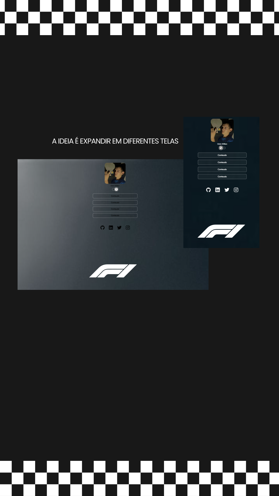

<h1 align="center"> Minhas Redes </h1>

Programa feito com o intuito de organizar links em um só lugar, seja para organizar links profissionais ou pessoais.

  <a href="#-tecnologias">Tecnologias</a>&nbsp;&nbsp;&nbsp;|&nbsp;&nbsp;&nbsp;
  <a href="#-projeto">Projeto</a>&nbsp;&nbsp;&nbsp;|&nbsp;&nbsp;&nbsp;
  <a href="#-layout">Layout</a>&nbsp;&nbsp;&nbsp;|&nbsp;&nbsp;&nbsp;
  <a href="#memo-licença">Licença</a>

 

  

## 🚀 Tecnologias

Esse projeto foi desenvolvido com as seguintes tecnologias:

- HTML e CSS
- JavaScript
- Git e Github
- Figma

## 💻 Projeto

Este projeto apresenta uma página simples com links para minhas redes sociais, feita em HTML e CSS

## 🔖 Layout

Este projeto foi inicialmente prototipado no Figma, onde defini a interface e o design. Em seguida, desenvolvi a página em HTML e CSS para apresentar de forma organizada os links das minhas redes sociais
